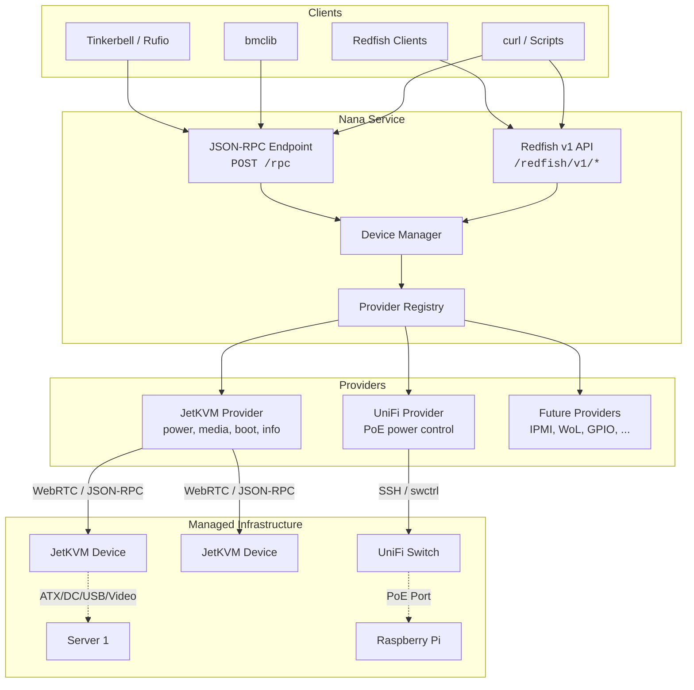
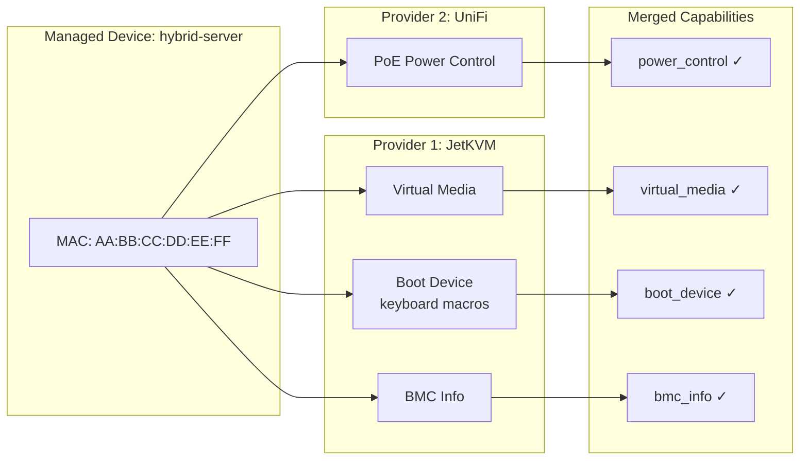
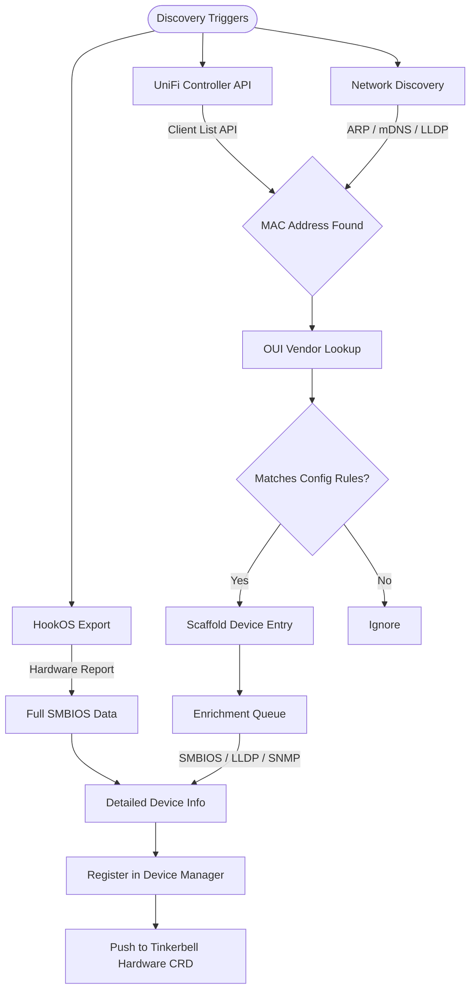
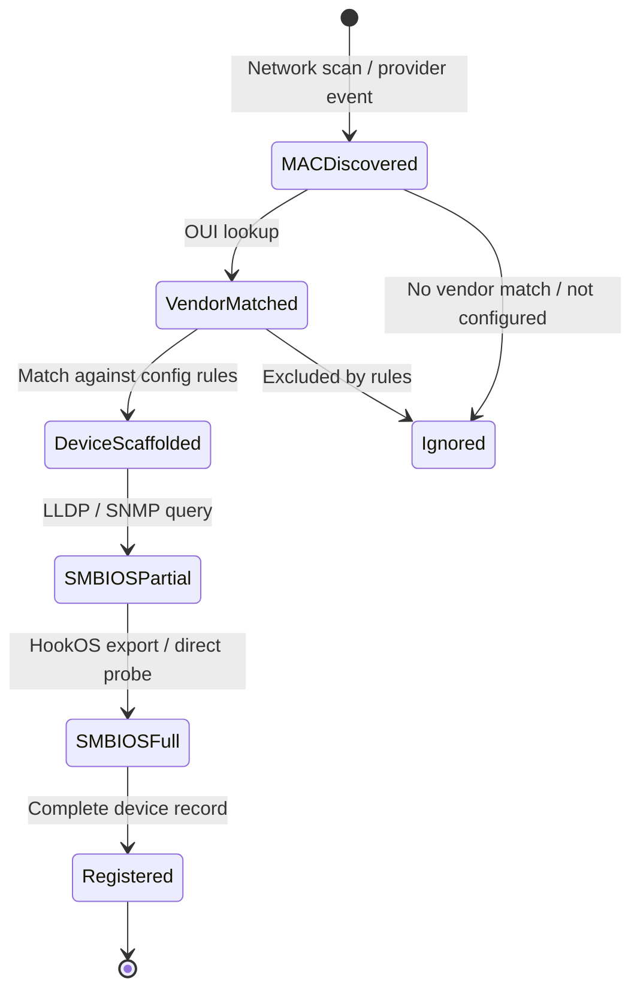
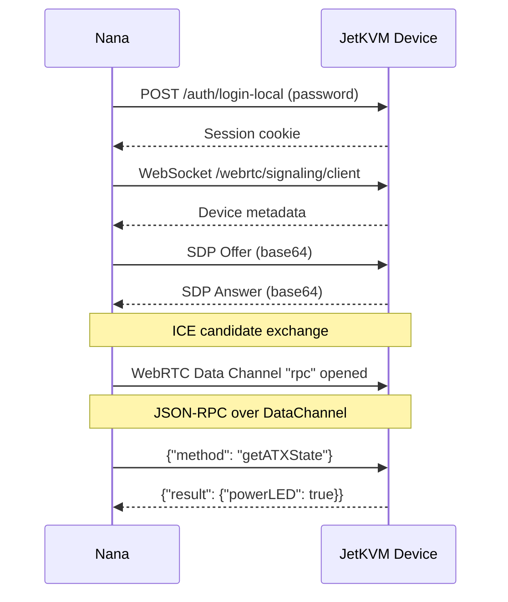
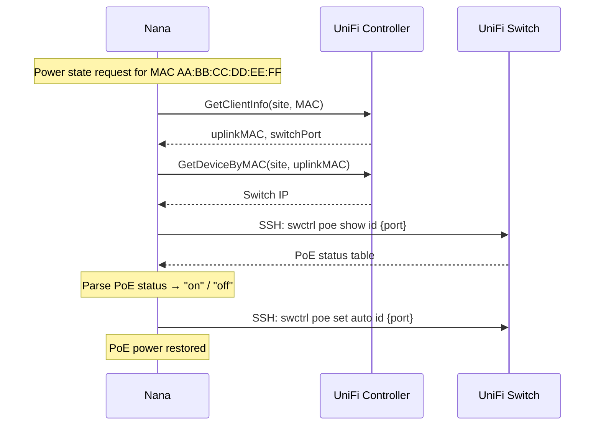
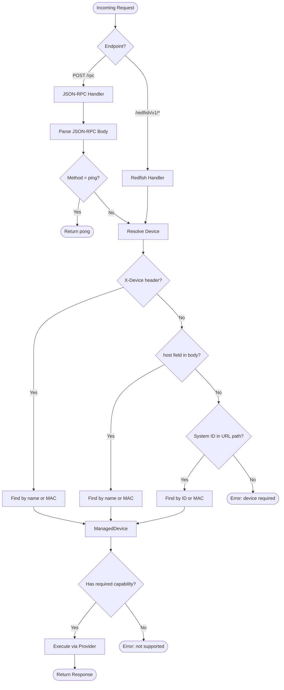
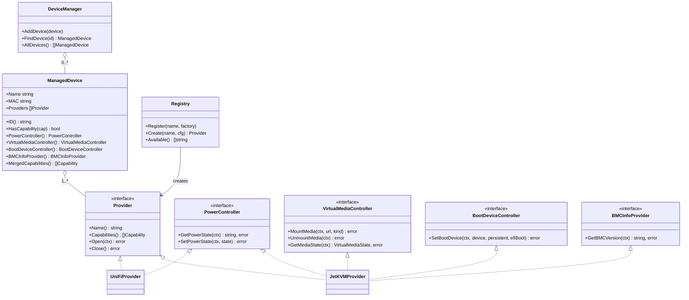
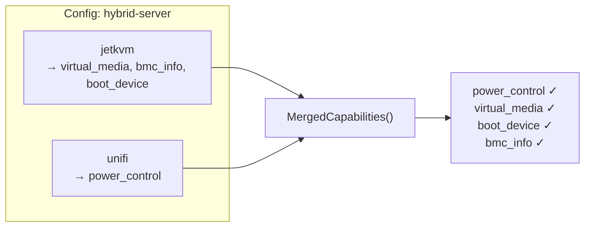

# Nana

[](https://pkg.go.dev/github.com/tinkerbell-community/nana)
[](go.mod)

**Nana** is a device management service that brings full BMC (Baseboard Management Controller) capabilities to any combination of remote management hardware. It provides two core functions: **BMC Emulation/Stitching** and **Device Discovery**.

Nana is designed for environments where traditional BMC hardware (iDRAC, iLO, IMM) is unavailable — such as consumer-grade servers, single-board computers, PoE-powered devices, and mixed hardware fleets — by composing capabilities from multiple pluggable providers into a unified, standards-compliant BMC interface.

## Overview



## Key Functions

### 1. BMC Emulation & Stitching

Nana's primary function is to **emulate a full BMC** by stitching together capabilities from multiple provider backends. Not every device has a traditional BMC — Nana solves this by composing partial capabilities from different sources into a single, unified management interface.

**How it works:**

- Each provider implements a subset of BMC capabilities (power control, virtual media, boot device selection, BMC info)
- A single managed device can have **multiple providers**, and their capabilities are **merged** at runtime
- The merged capability set is exposed through both **bmclib-compatible JSON-RPC** and **DMTF Redfish v1** APIs
- Providers can be mixed freely — for example, a JetKVM providing KVM/virtual media and a UniFi switch providing PoE power control for the same device



**Supported capability matrix:**

| Capability | JetKVM | UniFi | Description |
| --- | :---: | :---: | --- |
| `power_control` | ✓ (ATX/DC) | ✓ (PoE) | Get/set power state (on, off, cycle, reset) |
| `virtual_media` | ✓ | — | Mount/unmount ISO images via HTTP URL |
| `boot_device` | ✓ (macros) | — | Set next boot device via keyboard macro sequences |
| `bmc_info` | ✓ | — | Get BMC firmware version |

**Partial configuration** is fully supported — a device backed only by a UniFi provider will expose only power control through Redfish and RPC, while the remaining capabilities gracefully return "not supported" errors.

### 2. Device Discovery

> **Status: Planned**

Nana aims to support automated device inventory population through multiple discovery mechanisms:

**Discovery pipeline:**



**Priority queue for device information:**

Nana uses a decision tree to progressively enrich device information, starting from the minimum viable data (a MAC address) and seeking full SMBIOS information:



**Planned discovery features:**

- **Network discovery** — ARP scanning, mDNS, LLDP to find devices on the local network
- **Provider-sourced discovery** — UniFi controller client lists, switch MAC tables, DHCP leases
- **OUI vendor matching** — Match discovered MAC addresses against known vendor prefixes (e.g., Raspberry Pi Foundation) to auto-classify devices
- **HookOS integration** — Collect detailed hardware information (SMBIOS, disk, NIC data) exported by [HookOS](https://github.com/tinkerbell/hook) to Tinkerbell Hardware CRDs
- **Device matching rules** — Configurable rules to auto-populate the device list based on discovery. For example: "All Raspberry Pis discovered via UniFi should be added as PoE-powered devices with UniFi power control"
- **Progressive enrichment** — Start with a MAC address, progressively gather vendor info, LLDP data, SNMP details, and full SMBIOS records through a priority queue

## Supported Providers

### JetKVM

The [JetKVM](https://github.com/jetkvm/kvm) provider connects to local JetKVM devices via WebRTC and provides comprehensive BMC capabilities.

**Capabilities:** `power_control`, `virtual_media`, `bmc_info`, `boot_device` (when boot macros are configured)

**Connection flow:**



**Power management:**

- Detects active extension (`atx-power` or `dc-power`) automatically
- ATX: power-on, power-off, power-cycle, reset via front panel header emulation
- DC: on/off via DC power control extension
- Polls power state after action until desired state is reached
- Sends Wake-on-LAN magic packets on power-on (if WoL devices configured)

**Virtual media:**

- Mount ISO/disk images from HTTP URLs
- Supports `cdrom` and `floppy` modes
- Query current mount state

**Boot device macros:**

- Configurable keyboard macro sequences to select boot devices in BIOS/UEFI
- Macros are queued and executed after power-on, once the display and USB are ready
- Waits for video signal and USB "configured" state before sending keystrokes
- Supports HID key codes, modifiers, and per-step delays

**Configuration:**

```yaml
providers:
  - type: "jetkvm"
    host: "192.168.1.100"      # JetKVM device IP
    password: "optional"        # Device password (empty for noPassword mode)
    boot:                       # Optional boot device macros
      - device: "pxe"
        delay: 2s               # Wait after power-on
        steps:
          - keys: ["f12"]       # Press F12 for boot menu
            delay: 2s
          - keys: ["down"]
            delay: 500ms
          - keys: ["enter"]
```

### UniFi

The UniFi provider controls PoE power on Ubiquiti switches via the UniFi Controller API and SSH.

**Capabilities:** `power_control`

**How it works:**



**Key features:**

- **Auto-discovery of upstream switch and port** — Given only the device's MAC address, Nana queries the UniFi controller API to find which switch and port the device is connected to
- **SSH key derivation** — Deterministically generates an Ed25519 SSH key from the UniFi API key (no separate key management needed)
- **Auto-provisioned SSH access** — Automatically ensures the derived SSH public key is present in the UniFi controller's management settings
- **SSH connection pooling** — Reuses SSH connections to switches across multiple operations and providers
- **Retry with re-discovery** — On SSH failure, invalidates the cached uplink info and re-discovers the switch/port before retrying
- **PoE commands** — Uses `swctrl poe` CLI commands over SSH:
  - `swctrl poe show id {port}` — Get port PoE status
  - `swctrl poe set auto id {port}` — Enable PoE (power on)
  - `swctrl poe set off id {port}` — Disable PoE (power off)
  - `swctrl poe restart id {port}` — Power cycle

**Configuration:**

```yaml
providers:
  - type: "unifi"
    api_key: "your-unifi-api-key"  # UniFi API key (also used for SSH key derivation)
    site: "default"                 # UniFi site name
```

## API Reference

### JSON-RPC Endpoint (`POST /rpc`)

bmclib-compatible JSON-RPC interface. Device identified by `X-Device` header (name or MAC) or `host` field in JSON body.

**Request format:**

```json
{"id": 1, "host": "server-01", "method": "getPowerState", "params": {}}
```

**BMC-compatible methods:**

| Method | Params | Description |
| --- | --- | --- |
| `getPowerState` | — | Returns `"on"`, `"off"`, or `"unknown"` |
| `setPowerState` | `{"state": "on\|off\|cycle\|reset"}` | Set power state |
| `setVirtualMedia` | `{"mediaUrl": "...", "kind": "cdrom"}` | Mount media (empty URL to unmount) |
| `setBootDevice` | `{"device": "pxe", "persistent": false, "efiBoot": true}` | Set next boot device |
| `getVersion` | — | Get BMC firmware version |
| `ping` | — | Health check, returns `"pong"` |

**Extended methods:**

| Method | Params | Description |
| --- | --- | --- |
| `mountMedia` | `{"url": "...", "mode": "cdrom"}` | Mount media (direct) |
| `unmountMedia` | — | Unmount current media |
| `getMediaState` | — | Get current virtual media state |

### Redfish v1 API

DMTF Redfish-compliant REST API with OData annotations.

| Endpoint | Method | Description |
| --- | --- | --- |
| `/redfish/v1/` | GET | Service Root |
| `/redfish/v1/Systems` | GET | Computer System Collection |
| `/redfish/v1/Systems/{id}` | GET | Computer System (power state, actions, MAC) |
| `/redfish/v1/Systems/{id}/Actions/ComputerSystem.Reset` | POST | Reset system (`ResetType`: On, ForceOff, GracefulShutdown, ForceRestart) |
| `/redfish/v1/Systems/{id}/VirtualMedia` | GET | Virtual Media Collection |
| `/redfish/v1/Systems/{id}/VirtualMedia/{vmId}` | GET | Virtual Media instance |
| `/redfish/v1/Systems/{id}/VirtualMedia/{vmId}/Actions/VirtualMedia.InsertMedia` | POST | Insert media |
| `/redfish/v1/Systems/{id}/VirtualMedia/{vmId}/Actions/VirtualMedia.EjectMedia` | POST | Eject media |
| `/redfish/v1/Managers` | GET | Manager Collection |
| `/redfish/v1/Managers/{id}` | GET | Manager (firmware version, capabilities) |
| `/healthz` | GET | Service health check |

**System ID** is the device name (if set) or MAC address with colons replaced by dashes (e.g., `AA-BB-CC-DD-EE-FF`).

### Request Flow



## Architecture

### Capability-Based Provider System



### Directory Structure

```text
nana/
├── cmd/nana/              # CLI entrypoint (Cobra command, HTTP server setup)
│   ├── main.go            # Server bootstrap, provider registration, route binding
│   └── main_test.go
├── internal/
│   ├── api/               # HTTP handlers
│   │   ├── payload.go     # JSON-RPC request/response types and method constants
│   │   ├── service.go     # bmclib-compatible JSON-RPC handler
│   │   ├── redfish.go     # Redfish v1 REST API handlers
│   │   ├── service_test.go
│   │   └── redfish_test.go
│   ├── config/            # Configuration (Viper + Cobra flags)
│   │   ├── config.go      # Config structs, validation, loading
│   │   └── config_test.go
│   └── providers/         # Provider framework
│       ├── providers.go   # Capability interfaces (Provider, PowerController, etc.)
│       ├── registry.go    # Factory registry, DeviceManager, ManagedDevice
│       ├── providers_test.go
│       ├── jetkvm/        # JetKVM provider implementation
│       │   ├── jetkvm.go  # Provider struct, factory, boot config parsing
│       │   ├── power.go   # Power control (ATX/DC, WoL, device readiness)
│       │   ├── media.go   # Virtual media mount/unmount
│       │   ├── boot.go    # Boot device keyboard macros
│       │   ├── info.go    # BMC version info
│       │   └── client/    # WebRTC JSON-RPC client for JetKVM devices
│       │       ├── jetkvm.go      # Full client: WebRTC, data channel, RPC calls
│       │       └── jetkvm_test.go
│       └── unifi/         # UniFi provider implementation
│           ├── unifi.go   # Provider struct, factory, uplink discovery, SSH execution
│           ├── power.go   # PoE power control via swctrl
│           ├── ssh_pool.go # SSH connection pool
│           ├── ssh_key.go # Deterministic SSH key derivation from API key
│           └── unifi_test.go
├── example-config.yaml    # Annotated example configuration
├── Dockerfile             # Multi-stage container build
├── Makefile               # Build, test, lint targets
└── go.mod
```

## Configuration

Configuration via YAML file, environment variables (`JETKVM_API_` prefix), or CLI flags.

### Server Settings

| Setting | CLI Flag | Env Var | Default | Description |
| --- | --- | --- | --- | --- |
| `port` | `--port` | `JETKVM_API_PORT` | `5000` | HTTP server port |
| `address` | `--address` | `JETKVM_API_ADDRESS` | `0.0.0.0` | HTTP server bind address |
| `log_level` | `--log-level` | `JETKVM_API_LOG_LEVEL` | `info` | Log level (debug, info, warn, error) |
| `webrtc_timeout` | `--webrtc-timeout` | `JETKVM_API_WEBRTC_TIMEOUT` | `30` | WebRTC connection timeout (seconds) |
| `maxprocs_enable` | — | `JETKVM_API_MAXPROCS_ENABLE` | `true` | Auto-set GOMAXPROCS |
| `memlimit_enable` | — | `JETKVM_API_MEMLIMIT_ENABLE` | `true` | Auto-set GOMEMLIMIT |
| `memlimit_ratio` | — | `JETKVM_API_MEMLIMIT_RATIO` | `0.9` | Memory limit ratio |

### Global Provider Defaults

The top-level `providers` list defines default configuration values for each provider type. When a device references a provider, any fields left empty on the device-level provider will be populated from the matching global default (matched by `type`). Device-level values always take precedence.

This reduces repetition when many devices share the same provider settings (e.g., the same UniFi API key or JetKVM password).

```yaml
# Global defaults — applied to all devices using these provider types
providers:
  - type: "jetkvm"
    password: "shared-password"
  - type: "unifi"
    api_key: "your-api-key"
    site: "default"

devices:
  - name: "server-01"
    mac: "AA:BB:CC:DD:EE:FF"
    providers:
      - type: "jetkvm"
        host: "192.168.1.100"
        # password inherited from global: "shared-password"

  - name: "server-02"
    mac: "11:22:33:44:55:66"
    providers:
      - type: "jetkvm"
        host: "192.168.1.101"
        password: "override"    # overrides global default
      - type: "unifi"
        # api_key and site inherited from global defaults
```

### Device Configuration

```yaml
devices:
  # Device with a single JetKVM provider (full BMC)
  - name: "server-01"
    mac: "AA:BB:CC:DD:EE:FF"
    providers:
      - type: "jetkvm"
        host: "192.168.1.100"
        password: ""

  # Device with JetKVM + boot macros
  - name: "server-02"
    mac: "11:22:33:44:55:66"
    providers:
      - type: "jetkvm"
        host: "192.168.1.101"
        password: "secret"
        boot:
          - device: "pxe"
            delay: 1s
            steps:
              - keys: ["f12"]
                delay: 2s
              - keys: ["down"]
                delay: 500ms
              - keys: ["enter"]

  # Device powered via UniFi PoE (power control only)
  - name: "rpi-cluster-01"
    mac: "DC:A6:32:XX:YY:ZZ"
    providers:
      - type: "unifi"
        api_key: "your-api-key"
        site: "default"

  # Hybrid: JetKVM for KVM + UniFi for PoE power
  - name: "hybrid-server"
    mac: "AA:BB:CC:DD:EE:02"
    providers:
      - type: "jetkvm"
        host: "192.168.1.102"
      - type: "unifi"
        api_key: "your-api-key"
        site: "default"
```

### Provider Capability Composition

When multiple providers are assigned to a device, Nana merges their capabilities:



When a capability is requested (e.g., `getPowerState`), the Device Manager returns the **first provider** that implements the required interface. This means provider order in the config determines priority.

## Tinkerbell Integration

Nana is designed as a companion service for [Tinkerbell](https://tinkerbell.org/), providing BMC management for hardware that lacks traditional BMC support.

### With Rufio (BMC Controller)

```yaml
apiVersion: bmc.tinkerbell.org/v1alpha1
kind: Machine
metadata:
  name: jetkvm-server-1
spec:
  connection:
    host: nana-service:5000
    providerOptions:
      rpc:
        consumerURL: http://nana-service:5000
        request:
          staticHeaders:
            X-Device: ["server-01"]
```

### With bmclib

```go
client := bmclib.NewClient("nana-service", "", "",
    bmclib.WithRPCOpt(rpc.Provider{
        ConsumerURL: "http://nana-service:5000",
        Opts: rpc.Opts{
            Request: rpc.RequestOpts{
                StaticHeaders: http.Header{
                    "X-Device": []string{"server-01"},
                },
            },
        },
    }),
)

err := client.SetPowerState("on")
```

## Usage

### Start the Server

```bash
# With config file
./nana --config=config.yaml

# Show help
./nana --help
```

### Example Requests

```bash
# Health check (no device needed)
curl -s -X POST http://localhost:5000/rpc \
  -H "Content-Type: application/json" \
  -d '{"method": "ping", "id": 1}'
# → {"id":1,"result":"pong"}

# Get power state via RPC
curl -s -X POST http://localhost:5000/rpc \
  -H "X-Device: server-01" \
  -H "Content-Type: application/json" \
  -d '{"method": "getPowerState", "id": 1}'
# → {"id":1,"result":"on"}

# Power cycle via RPC
curl -s -X POST http://localhost:5000/rpc \
  -H "X-Device: server-01" \
  -H "Content-Type: application/json" \
  -d '{"method": "setPowerState", "params": {"state": "cycle"}, "id": 2}'

# Mount ISO via RPC
curl -s -X POST http://localhost:5000/rpc \
  -H "X-Device: server-01" \
  -H "Content-Type: application/json" \
  -d '{"method": "setVirtualMedia", "params": {"mediaUrl": "http://example.com/boot.iso", "kind": "cdrom"}, "id": 3}'

# Get power state via Redfish
curl -s http://localhost:5000/redfish/v1/Systems/server-01 | jq .PowerState
# → "On"

# Reset via Redfish
curl -s -X POST http://localhost:5000/redfish/v1/Systems/server-01/Actions/ComputerSystem.Reset \
  -H "Content-Type: application/json" \
  -d '{"ResetType": "ForceRestart"}'

# Insert virtual media via Redfish
curl -s -X POST http://localhost:5000/redfish/v1/Systems/server-01/VirtualMedia/1/Actions/VirtualMedia.InsertMedia \
  -H "Content-Type: application/json" \
  -d '{"Image": "http://example.com/boot.iso"}'
```

## Development

### Build

```bash
go build -o nana ./cmd/nana
```

### Cross-Compile

```bash
make cross-compile    # Builds linux/amd64 and linux/arm64
```

### Test

```bash
make test             # Tests with race detector + coverage
go test ./...         # Quick test run
```

### Lint

```bash
make lint             # golangci-lint
```

### Docker

```bash
docker build -t nana .
docker run -v $(pwd)/config.yaml:/config.yaml nana --config=/config.yaml
```

## References

- [JetKVM firmware](https://github.com/jetkvm/kvm) — Device firmware with JSON-RPC handler definitions
- [bmclib](https://github.com/bmc-toolbox/bmclib) — BMC library with RPC provider support
- [Tinkerbell](https://tinkerbell.org/) — Bare metal provisioning engine
- [DMTF Redfish](https://www.dmtf.org/standards/redfish) — Redfish API specification
- [go-unifi](https://github.com/ubiquiti-community/go-unifi) — UniFi controller API client

## License

See [LICENSE](../LICENSE) for details.
